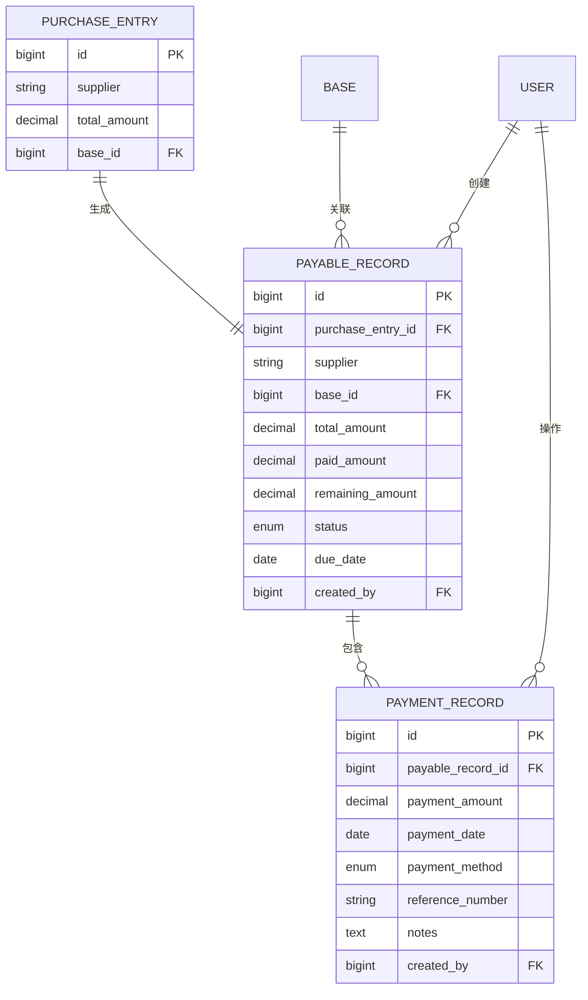

# 货款欠款管理系统设计

## 业务需求
- 公司与供应商的货款允许欠款
- 支持阶段性还款，不定金额
- 需要累计更新总欠款
- 提供欠款统计和还款历史查询

## 数据库表结构设计

### 1. 应付款记录表 (payable_records)
记录每笔采购产生的应付款

```sql
CREATE TABLE payable_records (
    id BIGINT UNSIGNED AUTO_INCREMENT PRIMARY KEY,
    purchase_entry_id BIGINT UNSIGNED NOT NULL,           -- 关联采购记录ID
    supplier VARCHAR(255) NOT NULL,                       -- 供应商名称
    base_id BIGINT UNSIGNED NOT NULL,                     -- 基地ID
    total_amount DECIMAL(15,2) NOT NULL,                  -- 应付总金额
    paid_amount DECIMAL(15,2) DEFAULT 0.00,               -- 已付金额
    remaining_amount DECIMAL(15,2) NOT NULL,              -- 剩余欠款
    status ENUM('pending', 'partial', 'paid') DEFAULT 'pending', -- 状态：待付款、部分付款、已付清
    due_date DATE NULL,                                    -- 到期日期
    created_by BIGINT UNSIGNED NOT NULL,                  -- 创建人ID
    created_at TIMESTAMP DEFAULT CURRENT_TIMESTAMP,
    updated_at TIMESTAMP DEFAULT CURRENT_TIMESTAMP ON UPDATE CURRENT_TIMESTAMP,
    
    INDEX idx_supplier (supplier),
    INDEX idx_base_id (base_id),
    INDEX idx_status (status),
    INDEX idx_due_date (due_date),
    FOREIGN KEY (purchase_entry_id) REFERENCES purchase_entries(id) ON DELETE CASCADE,
    FOREIGN KEY (base_id) REFERENCES bases(id),
    FOREIGN KEY (created_by) REFERENCES users(id)
);
```

### 2. 还款记录表 (payment_records)
记录每次还款的详细信息

```sql
CREATE TABLE payment_records (
    id BIGINT UNSIGNED AUTO_INCREMENT PRIMARY KEY,
    payable_record_id BIGINT UNSIGNED NOT NULL,           -- 关联应付款记录ID
    payment_amount DECIMAL(15,2) NOT NULL,                -- 还款金额
    payment_date DATE NOT NULL,                           -- 还款日期
    payment_method ENUM('cash', 'bank_transfer', 'check', 'other') DEFAULT 'bank_transfer', -- 还款方式
    reference_number VARCHAR(100) NULL,                   -- 参考号（如转账凭证号）
    notes TEXT NULL,                                       -- 还款备注
    created_by BIGINT UNSIGNED NOT NULL,                  -- 操作人ID
    created_at TIMESTAMP DEFAULT CURRENT_TIMESTAMP,
    
    INDEX idx_payable_record_id (payable_record_id),
    INDEX idx_payment_date (payment_date),
    FOREIGN KEY (payable_record_id) REFERENCES payable_records(id) ON DELETE CASCADE,
    FOREIGN KEY (created_by) REFERENCES users(id)
);
```

## 数据模型关系



## 业务逻辑

### 1. 采购创建时
- 自动为每笔采购创建对应的应付款记录
- 初始状态为 'pending'
- remaining_amount = total_amount

### 2. 还款操作时
- 创建还款记录
- 更新应付款记录的 paid_amount 和 remaining_amount
- 根据剩余金额更新状态：
  - remaining_amount = 0 → 'paid'
  - 0 < remaining_amount < total_amount → 'partial'
  - remaining_amount = total_amount → 'pending'

### 3. 统计查询
- 按供应商统计总欠款
- 按基地统计欠款情况
- 按时间范围查询还款记录
- 超期未付款提醒

## API设计

### 应付款管理
- GET /api/payable/list - 应付款列表
- GET /api/payable/stats - 应付款统计
- GET /api/payable/overdue - 超期应付款

### 还款管理  
- POST /api/payment/create - 创建还款记录
- GET /api/payment/list - 还款记录列表
- GET /api/payment/history/:payable_id - 特定应付款的还款历史

### 统计报表
- GET /api/payable/summary - 欠款总览
- GET /api/payable/by-supplier - 按供应商统计
- GET /api/payable/by-base - 按基地统计