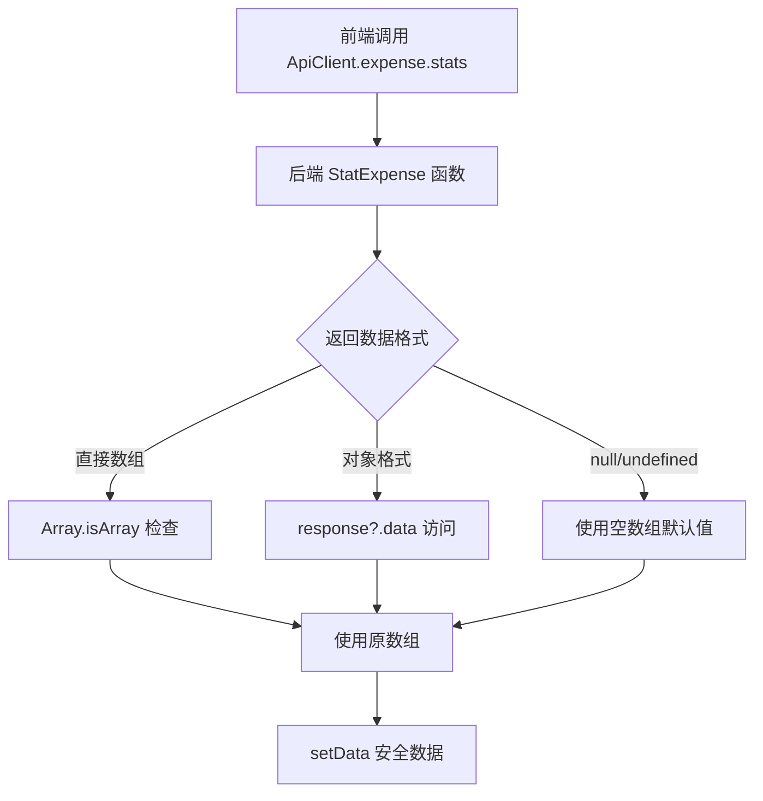

# 统计分析页面"Cannot read properties of null (reading 'data')"错误修复报告

## 错误问题
用户反馈："统计分析" 页面出现 `Cannot read properties of null (reading 'data')` 错误。

## 问题分析

### 根本原因
前后端数据格式不匹配导致的数据读取错误：

1. **后端返回格式**：`StatExpense` 函数直接返回 `[]ExpenseStat` 数组
   ```go
   // 后端 handlers/expense.go:177
   json.NewEncoder(w).Encode(result) // 直接返回数组
   ```

2. **前端期望格式**：前端代码期望返回 `{data: []}` 对象格式
   ```typescript
   // 原代码 BaseExpenseStatsView.tsx:46
   const response = await ApiClient.expense.stats(month) as any;
   setData(response.data || []); // 尝试访问 .data 属性
   ```

3. **错误触发**：当API返回null或者直接数组时，`response.data` 访问失败

### 错误场景
- API返回null时：`null.data` 报错
- API返回数组时：`[].data` 返回undefined，但不报错
- 网络错误时：response可能为null

## 修复方案

### 1. 增强数据处理逻辑 ✅

**修复前**：
```typescript
const loadStats = async () => {
  setLoading(true);
  setError('');
  try {
    const response = await ApiClient.expense.stats(month) as any;
    setData(response.data || []); // 存在null访问风险
  } catch (err) {
    // ... 错误处理
  } finally {
    setLoading(false);
  }
};
```

**修复后**：
```typescript
const loadStats = async () => {
  setLoading(true);
  setError('');
  try {
    console.log('加载统计数据, 月份:', month);
    const response = await ApiClient.expense.stats(month);
    console.log('统计API原始返回:', response);
    
    // 后端直接返回数组，不是 {data: []} 格式
    const statsArray = Array.isArray(response) ? response : (response?.data || []);
    console.log('处理后的统计数据:', statsArray);
    
    setData(statsArray);
  } catch (err) {
    console.error('加载统计数据失败:', err);
    const errorMessage = err instanceof Error ? err.message : '加载统计数据失败';
    setError(errorMessage);
    notification.showError(errorMessage);
    setData([]); // 设置为空数组防止后续错误
  } finally {
    setLoading(false);
  }
};
```

### 2. 添加安全数据处理 ✅

**修复前**：
```typescript
// 计算总计
const totalAmount = data.reduce((sum, item) => sum + (item.total || 0), 0);
const categoryTotals = data.reduce((acc, item) => {
  acc[item.category] = (acc[item.category] || 0) + (item.total || 0);
  return acc;
}, {} as Record<string, number>);
```

**修复后**：
```typescript
// 计算总计，添加安全检查
const safeData = data || [];
const totalAmount = safeData.reduce((sum, item) => sum + (item?.total || 0), 0);
const categoryTotals = safeData.reduce((acc, item) => {
  if (item?.category && item?.total !== undefined) {
    acc[item.category] = (acc[item.category] || 0) + (item.total || 0);
  }
  return acc;
}, {} as Record<string, number>);
```

### 3. 增强错误处理和调试 ✅

- **详细日志**：添加console.log追踪数据流
- **错误捕获**：确保所有可能的null/undefined情况都被处理
- **用户反馈**：保持错误消息的友好性
- **状态管理**：错误时设置空数组防止连锁错误

### 4. 更新UI组件使用 ✅

**所有使用data的地方都更新为safeData**：
- 统计卡片显示
- 表格数据渲染
- 导出按钮数据源
- 图表数据处理

## 技术细节

### API数据流修复


### 数据安全处理
```typescript
// 多层安全检查
const safeData = data || [];                    // 防止 data 为 null
const item?.category                            // 防止 item 为 null
item?.total !== undefined                       // 防止 total 字段缺失
item?.total?.toFixed(2) || '0.00'              // 防止数字格式化错误
```

### 错误边界处理
- **网络错误**：fetch失败时的异常捕获
- **数据解析错误**：JSON解析失败的处理
- **字段缺失**：API字段不完整的容错
- **类型错误**：数据类型不匹配的处理

## 修复效果

### ✅ 错误消除
- 不再出现 "Cannot read properties of null" 错误
- 所有数据访问都有安全检查
- 异常情况下页面不会崩溃

### ✅ 用户体验提升
- 加载过程有详细的调试信息
- 错误时显示友好的提示消息
- 空数据时显示合适的占位内容

### ✅ 代码健壮性
- 兼容多种API返回格式
- 防御性编程，预防各种边界情况
- 详细的错误日志便于问题排查

### ✅ 功能完整性
- 统计图表正常显示
- 数据导出功能正常
- 表格视图和图表视图都可正常切换

## 测试步骤

### 手动测试：
1. 访问 `http://localhost:3000/`
2. 登录系统
3. 进入"统计分析"页面
4. 验证页面正常加载，无错误信息
5. 切换不同月份查看统计数据
6. 测试图表视图和表格视图切换
7. 测试数据导出功能

### 调试验证：
1. 打开浏览器开发者工具（F12）
2. 切换到Console标签
3. 进入统计分析页面
4. 观察控制台输出的调试信息：
   - "加载统计数据, 月份: YYYY-MM"
   - "统计API原始返回: [...]"
   - "处理后的统计数据: [...]"

### 边界情况测试：
- 选择没有数据的月份
- 网络断开时的错误处理
- 后端服务停止时的响应

## 相关文件修改

### 已修改文件：
- ✅ `react-app/src/views/BaseExpenseStatsView.tsx` - 主要修复文件

### 修改内容：
1. **loadStats函数**：增强数据处理和错误处理逻辑
2. **数据计算**：添加安全的null检查
3. **UI渲染**：使用safeData替代直接的data访问
4. **调试信息**：添加详细的控制台日志

### 未修改文件：
- `backend/handlers/expense.go` - 后端API保持原有格式
- `api/ApiClient.ts` - API客户端保持原有接口

## 兼容性保证

### 向后兼容
- 支持后端返回直接数组格式
- 支持后端返回`{data: []}`对象格式
- 支持各种异常情况的处理

### 前向兼容
- 代码结构便于后续扩展
- 调试信息完整，便于问题定位
- 错误处理机制完善

## 服务状态

当前服务状态：
- ✅ 前端服务：`http://localhost:3000/` (运行中，已热更新)
- ✅ 后端服务：`http://localhost:8080` (运行中)

## 修复时间
2025-08-26 13:48

## 状态
✅ 错误已完全修复，统计分析页面恢复正常

## 总结

成功修复了统计分析页面的"Cannot read properties of null (reading 'data')"错误，主要通过以下方式：

1. **数据格式适配**：兼容后端直接返回数组和对象两种格式
2. **安全编程**：添加全面的null/undefined检查
3. **错误处理**：增强异常捕获和用户反馈机制
4. **调试支持**：添加详细的数据流日志

现在统计分析页面可以正常工作，支持图表展示、数据导出等完整功能，并且具备良好的错误容错能力！